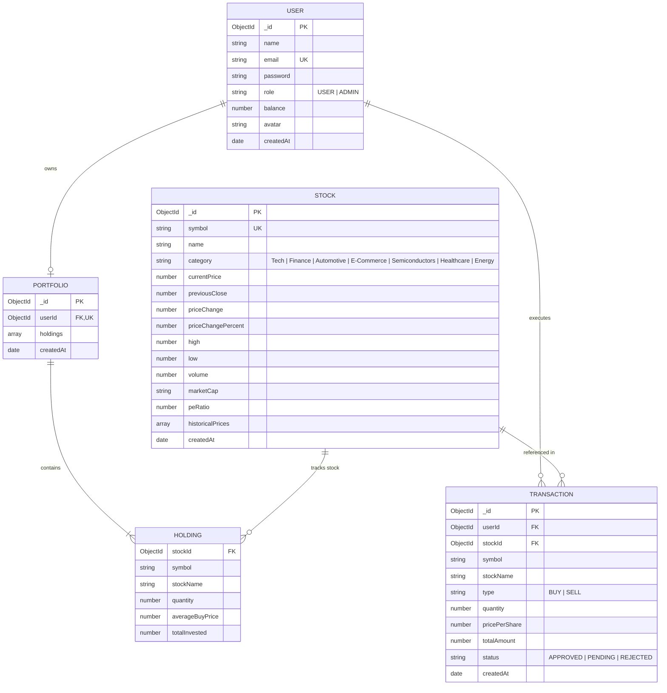
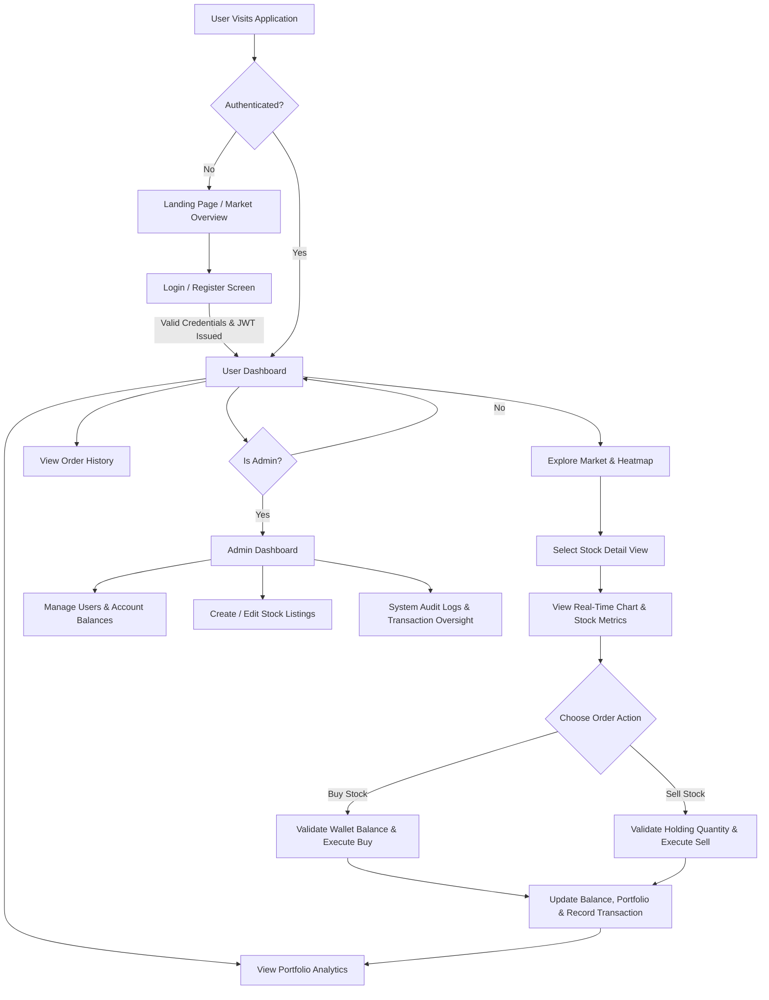

# 📈 ShopEZ - Stock Trading Platform (MERN)

A full-stack, real-time simulated stock market and portfolio management platform built with the MERN stack (MongoDB, Express, React, Node.js).

---

## 📌 About the Project

ShopEZ Stock Trading Platform is an interactive financial platform designed to bridge the gap between novice investors and dynamic stock market trading. It provides users with a simulated trading environment featuring real-time price updates, portfolio metrics, transaction histories, and administrative risk management tools.

### 🔗 Project Links
- **🌐 Vercel (Frontend Live App)**: [https://stockmarketing-mern.vercel.app](https://stockmarketing-mern.vercel.app)
- **🚀 Render (Backend API Service)**: [https://stockmarketing-mern.onrender.com](https://stockmarketing-mern.onrender.com)
- **📂 GitHub Repository**: [https://github.com/Thangaraj25/StockMarketing-MERN](https://github.com/Thangaraj25/StockMarketing-MERN)
- **🩺 API Health Check**: [https://stockmarketing-mern.onrender.com/api/health](https://stockmarketing-mern.onrender.com/api/health)

---

## 🎯 Problem Statement

### **Background & Core Problem**
Navigating real-world financial stock markets can be intimidating for beginners due to high capital risk, complex broker interfaces, and market volatility. Traditional simulation tools often suffer from static data, non-intuitive user interfaces, or lack of transparent execution records.

### **The Solution**
ShopEZ addresses these challenges by offering:
1. **Risk-Free Simulated Trading**: Virtual account balances ($10,000 initial seed) allowing users to practice buying/selling assets safely.
2. **Real-Time Ticker Simulation**: Automatic background price fluctuations and live market trends to reflect dynamic market environments.
3. **Comprehensive Portfolio Analytics**: Real-time tracking of profit/loss (P&L), return on investment (ROI), asset allocation heatmaps, and transaction logs.
4. **Role-Based Admin Oversight**: Administrative tools for managing market listings, user balances, and system audit logs.

---

## 📊 Entity-Relationship (ER) Diagram



---

## 🔄 User Flow Diagram



---

## 🛠️ Tech Stack & Architecture

- **Frontend**: React 18, Vite, Tailwind CSS, Lucide Icons, Axios, React Router DOM v6
- **Backend**: Node.js, Express.js, JWT Authentication, CORS Middleware
- **Database**: MongoDB Atlas (Mongoose ODM)
- **Deployment**: Vercel (Frontend SPA), Render (Backend Web Service)

---

## 💻 Local Development Setup

### Prerequisites
- Node.js (v18+)
- MongoDB Atlas Connection String

### 1. Clone Repository
```bash
git clone https://github.com/Thangaraj25/StockMarketing-MERN.git
cd StockMarketing-MERN
```

### 2. Backend Setup
```bash
cd backend
npm install
npm run dev
```

### 3. Frontend Setup
```bash
cd ../frontend
npm install
npm run dev
```